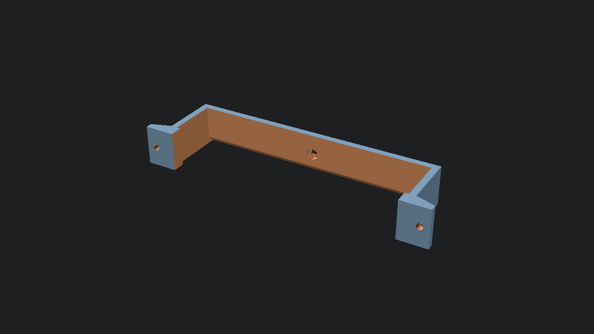

# **Lenovo ThinkCentre Tiny Series Under-desk Mount**



A parametric OpenSCAD model designed to mount a Lenovo ThinkCentre M75q (and similar Tiny series PCs) under a desk.

## **Features**

* **180mm Bed Compatible:** Designed to print diagonally on smaller printers (like the Prusa Mini).  
* **Secure:** Features a locking screw mechanism to prevent the PC from sliding out when cables are pulled.  
* **Airflow:** Configurable gap prevents heat transfer to the desk surface.  
* **Retaining Clips:** Top rails ensure the PC stays seated.

## **Building**

### **Generate STL for Printing**

To generate the STL file:

```bash
nix build
```

The resulting file will be located at ./result/thinkcentre_mount.stl.

## **Development**

To enter a shell with OpenSCAD available for editing:

```bash
nix develop
```
